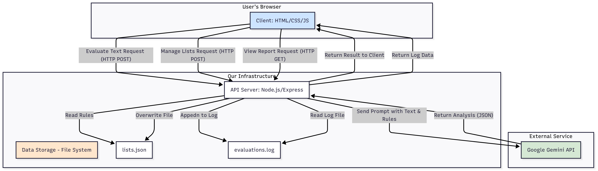

# AI-Powered Content Moderation Service

This project is a simple web application that provides a content moderation service. It uses a Node.js/Express backend to serve a vanilla JavaScript frontend. The core evaluation logic is handled by the Google Gemini API, which analyzes text for profanity based on a customizable, file-based blacklist and whitelist.

## Features

-   **AI-Powered Evaluation**: Leverages a Large Language Model (LLM) for nuanced text analysis.
-   **Customizable Rules**: Uses a `lists.json` file to manage blacklisted (forbidden) and whitelisted (always allowed) words.
-   **Simple Administration**: The frontend allows for easy management of the blacklists and whitelists, with changes saved directly on the server.
-   **Evaluation Logging**: All analysis requests and their results are logged to a file (`evaluations.log`) for reporting.
-   **API-First Design**: A simple REST API to manage lists and logs.

---

## 🚀 Setup and Installation

Follow these steps to get the project running locally.

### Prerequisites

-   [Node.js](https://nodejs.org/) (v18.x or later recommended)
-   `npm` (comes with Node.js)
-   A Google AI API Key ([get one here](https://aistudio.google.com/))

### Installation

1.  **Clone the repository:**
    ```bash
    git clone <your-repository-url>
    cd <your-repository-name>
    ```

2.  **Install dependencies:**
    ```bash
    npm install
    ```

3.  **Set up environment variables:**
    Create a file named `.env` in the root of the project and add your Google AI API Key.

    Use the `.env.example` file as a template:
    ```
    # .env.example
    GEMINI_API_KEY="YOUR_GOOGLE_AI_API_KEY_HERE"
    ```

4.  **Run the server:**
    ```bash
    node server.js
    ```

5.  **Access the application:**
    Open your web browser and navigate to `http://localhost:3000`.

---

## ⚙️ API Endpoints

The server exposes the following REST API endpoints.

### Lists Management

-   #### `GET /api/lists`
    -   **Description**: Retrieves the current blacklist and whitelist.
    -   **Method**: `GET`
    -   **Response (200 OK)**:
        ```json
        {
          "blacklist": ["word1", "word2"],
          "whitelist": ["word3", "word4"]
        }
        ```

-   #### `POST /api/lists`
    -   **Description**: Overwrites the `lists.json` file with the provided data.
    -   **Method**: `POST`
    -   **Request Body**:
        ```json
        {
          "blacklist": ["new_word1", "new_word2"],
          "whitelist": ["new_word3"]
        }
        ```
    -   **Response (200 OK)**:
        ```json
        {
          "message": "Lists updated successfully!"
        }
        ```

### Evaluation Logging

-   #### `GET /api/log`
    -   **Description**: Retrieves the contents of the `evaluations.log` file as plain text.
    -   **Method**: `GET`
    -   **Response (200 OK)**:
        ```
        [2025-08-30T21:20:00.000Z] | TEXT: "example text" | IS_VALID: true | SCORE: 0 | CENSORED: "example text"
        ```

-   #### `POST /api/log`
    -   **Description**: Appends a new entry to the `evaluations.log` file. This is called automatically by the frontend after an evaluation.
    -   **Method**: `POST`
    -   **Request Body**:
        ```json
        {
          "text": "This is a damn test.",
          "result": {
            "isValid": false,
            "profanityScore": 4,
            "censoredText": "This is a **** test."
          }
        }
        ```
    -   **Response (200 OK)**:
        ```json
        {
          "message": "Log entry added successfully!"
        }
        ```

---

## 👥 Roles

This is a simple system without formal user authentication. The roles are implicit:

-   **User**: Interacts with the frontend at `http://localhost:3000` to evaluate text and view reports.
-   **Administrator**: The person who runs the server, has direct access to the file system (`lists.json`, `evaluations.log`), and manages the `.env` file containing the API key.

---

# DIAGRAM



---

# CURL

## Retrieves the current blacklist and whitelist
curl http://localhost:3000/api/lists

## Overwrites the lists.json file with new content
curl -X POST http://localhost:3000/api/lists \
-H "Content-Type: application/json" \
-d '{
  "blacklist": ["new-bad-word", "another-one"],
  "whitelist": ["perfectly-fine-word"]
}'

## Appends a new entry to the evaluations.log file
curl -X POST http://localhost:3000/api/log \
-H "Content-Type: application/json" \
-d '{
  "text": "This is a test from curl",
  "result": {
    "isValid": true,
    "profanityScore": 0,
    "censoredText": "This is a test from curl"
  }
}'

## Retrieves the entire log file as plain text
curl http://localhost:3000/api/log
